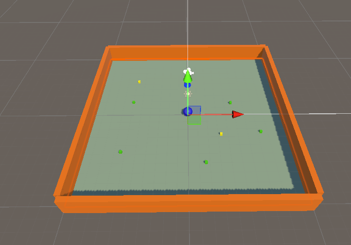

<blockquote>
  Developping a Roll a ball game using Unity
</blockquote>

During a HCI course, we had to develop a simple roll a ball game. 

The goal of the game is to gather all the green cubes. Each green cube give you one point and each yellow one give you -1 points. The goal is to achieve a score of 5 and there is 5 green cubes.

The game will be at the third person meaning that the camera will follow the rolling ball from above. 

<blockquote>
  Setup Unity 
</blockquote>

Create a project on Unity using the same version and template. 

<blockquote>
  Create the game
</blockquote>

Before coding, we need to create the scene of the game. On the picture below, we can see that we'ev created a simple surface including the floor and borders.

Then you need to creat the player object : the ball. 
You can do all these tasks by right clicking on the left side of the window under the SampleScene > 3D Object and then choose the object you want to create.

You can then modify this object by scaling it, rotate etc...

When you create the ball (the sphere) the important thing to do is to assign it a rigidbody collider and a ball collider. This will enable to detet collision and trigger actions.

<blockquote>
  Coding
</blockquote>

As we said, the goal of the game is to gather all the green cubes. Each green cube give you one point and each yellow one give you -1 points. The goal is to achieve a score of 5 and there is 5 green cubes.

**Moving the ball** 

As the ball is moving in a 2D plane, we must assign a 2D vector

Then we apply our movement to the rigidboyd of the ball to make it move : 

The ball moves with the up or down arrow of our keyboard but when running it on our mobile phone, it moves with the orientation of the mobile phone.

**Collectibles**

To continue the development of the game, we need to assign the collectible objects : the cubes. The green ones give us +1 point and the yellow one -1. 

To do so, we've created two Tags : PickUpGreenParents and PickUpYellowParents. 

**Winning or losing text**

The game end with a sentence written on the screen wether you won or lost. To do so, we simply compare the value of the score and display different messages 

On the gameplay, it looks like this : 

.

**Using it on an Iphone** 

To do it, you need to install the right dependencies of the OS you are using. Once you've installed the right one, install Unity Remote 5, connect your phone to your computer, go to File>BuildSettings and start building it on your phone. 