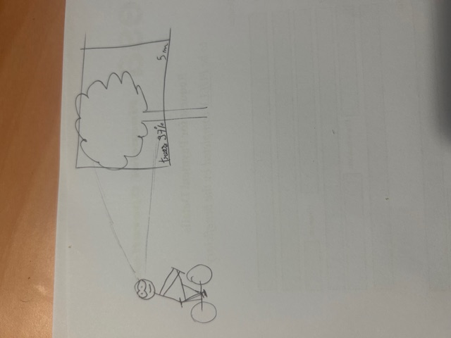
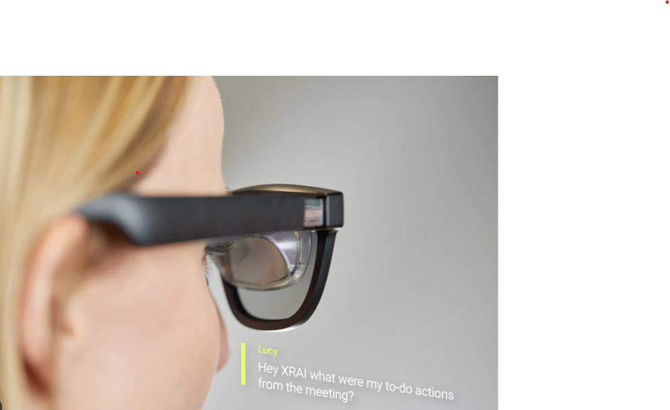
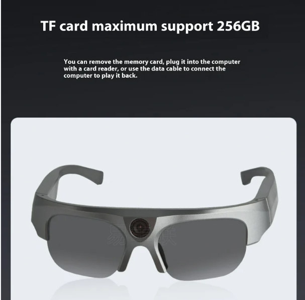

<blockquote>
  Ideas of concept to enhance human abilities with AR
</blockquote>

**Enhance spatial awareness for navigation and safety**

An AR headset or glasses that improves spatial awareness by highlighting obstacles, potential hazards, or routes in real-time. For example, it could be used by cyclists to anticipate road conditions or by warehouse workers to avoid collisions with machinery. It increases safety in different environments and allow users to react proactively to changes in their surrounding.

**Real Time translation and language assistance**

AR glasses that provide real-time translation of foreign languages, displaying translated text or phrases on surfaces or even providing for conversations. This idea could be ideal for tourists or business or even to learn a language. 
It reduces the language barrier that people can face and that can create difficulty to build relations.

**Real time memory assistant** 

An AR tool that helps users remember key information about people, places, and objects. This could be during a conversation with someone, for object locations (for example when you lost your keys it helps you to remember the last time you saw it). 
Improve our productivity and reduce the mental load of remembering numerous details.

<blockquote>
  Prototyping
</blockquote>

My prototype is pretty much the one I've tried to draw on my first idea (not a good drawer). The idea is that it is a mask that help spatial awareness for navigation and safety. It will work with neural networks that has been trained on specific databases, depending on your activities.

<blockquote>
  Feedback
</blockquote>

I asked several person of my surrounding and they pretty like the idea. The main point was the accuracy of the device. They scared that the device could have some error while processing, and I argued them that it is true, but they still have their own mind to judge things, it's a device which is here to assist a human being and if it appears that it fails to recognize something, the user has its own eyes and can still perceive things. s well the autonomy of the device is a problem and the robustness of it. That's true that to make it work in such activities such as biking, we nered to ensure that the autonomy is enough and as well that it can be resistant.