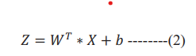
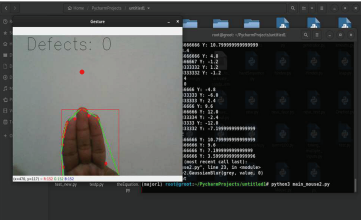
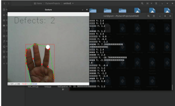
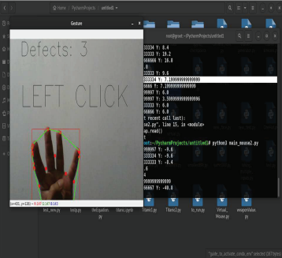
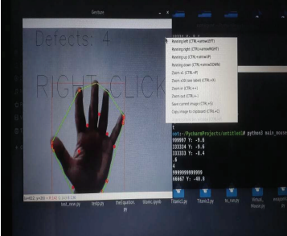
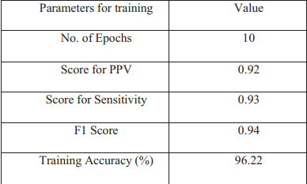

This blog is part an assigment part of a series of research from the course Human Computer Interface at Institut Polytechnique de Paris.

* I will first present a solution from Hitesh Kumar Sharma and his team about HCI controlled with AI.
* Then, we will approach the ultimate display by Ivan Sutherland.
<blockquote>
  HCI controlled AI enabled system for optimization 
</blockquote>

**Introduction :** 

In today's world, the basic interaction with computer is a keyboard and a mouse. Those tools are really easy to use and that's what made them famous. The only problem is for people with disabilities, those tools can be hard according to the severity of the disability. Also, another limit of a moouse is that we can't use it while moving. These problems lead Hitesh and his team to find a different effective interactive system which will work by controlling the mouse with hand gestures based on image recognition with a computer camera. Some solutions already exists but required to wear gloves which can be annoying in some situations.

**Solution and methods :**

What Hitesh Kumar Sharma and his team developed is a free glove mouse using only image recongition (without physical hardware).
To do such a job, they needed a training dataset. This dataset involved 12000 hand photos of 6 humans (3males and 3 females) with 10 hand gestures types. Due to resources restrictions, only one person sample is selected and 5 different type of gesture are used (ex: thumb down, up...).

The training of the model is based on forward propagation (data received, processed, output produced)
Calculate the error and update the network's parameters for backward propagation.
The formula for the output of a perceptron is the following one and the sigmoid activation function is used.

The implementation is made with OpenCV following different steps : 

* Capturing real time video using a web camera
* Processing image frame
* Flipping of image frame 
* Conversion to grayscale
* Finding contours 
* Counting the number of convexity defects
* Moving the mouse cursor when the number of convexity defects is equal to 2 (using pyautogui)
* Implementing left click and right click.

Example of possible moves : 

No move : 

Mouse Moving : 

Left Click : 

Right Click : 

The camera detect the number of convexity defects and choose its action in order to it.

**Conclusion :**

The results are relevant as the picture can show : 

So this technology can solve several problem and proved that it can work with efficiency and accuracy. It can be used for many application, and more complex systems.

<blockquote>
  The Ultimate Display by Ivan Sutherland
</blockquote>

Let's study the paper from a famous HCI researcher Ivan Sutherland. He is consider as a pioneer of HCI and received a Turing prize for inventing Sketchpad.

* Ivan Sutherland first point the fact that computer are a looking glass into a mathematical wonderland, a world which is not directly visible, accessible by a human being.
* He then discusses about different types of displayus such as audio, visual , kinesthic... and how they are able to create new object that defy reality's rule. Then he talks about different input devices such as keyboard, light pens, joysticks etc... and how they can be used to interact with compouters. He predicted that computer users will interact with a computer through a typewriter.
* The Ultimate Display : Ivan Sutherland envisions the ultimate display as a room where the computer is able to control and display the existence of matter. It could help humans to become familiar with such a world which is for instanc every abstrait for many of us.

<blockquote>
  Google glasses : A failed Innovation for the future
</blockquote>

The famous project Google Glass launched by Google in 2013 was a portable device with a futristic glasses shape which enable people
to display informations, notifications in augmented reality. directly in the vision field of the user thanks to a little projection located right in front of the user eyes. But this innovative looking project was actually a hyge fail and these are the main reasosn why : 

* Privacy issues : Google glasses had an integrated camera that enabled people to take photos/videos, but this raised many questions about confidentiality and privacy. People were fearing of being filmed and registered in their daily life and it massively contributed of this fail.

* Esthetic and social accessibility : The design of Google glasses was a lot criticized due to its weirdness and its unuser friendly shape. Users looked weird when putting the glasses on and society didn't really accept the design and the concept.

* Limited autonomy : The battery was one of the major disadvantages. It was too short to use it a whole day which limited the useness of this device in situations where the user wanted to use it all day long.

* Bad Software integraiton : Despite its technics abalities, Google Glass didn't have enough applications to be as attractive as a smartphone for example. This led to a fail of the concept adoption.

The project failed in the past but might become a success in the future and why ? 

* Techno improvement : Some huge progress has been done in the field of AR. As Microsoft HoloLens and Magic Leap can show, such devices can have a potential in different fields such as industry, education and many others. A different version of Google Glass has been released for the industry in order to help workers in their tasks

* Changes in social behaviours : As the time is going, people are getting more and more familiar with new technologies. So AR glasses could become more accepted by society and this brake to move forward could become a strength.

* Use cases in different fields : Even though Google Glass has failed as a massive consumer product, it can find its different fields in which it can have a drastic help for example : Healthcare, logistic and many others.

**Conclusion :**

Even though Google Glass experienced a significant failure in 2013, this technology should not be abandoned, as its various use case applications demonstrate its potential.

Bibilography : 

* [Human Computer Interfact (HCI) controleld AI enabled systemfor Optimization](https://e-tarjome.com/storage/panel/fileuploads/2023-06-15/1686814500_e-tarjome-e17469.pdfhttps://e-tarjome.com/storage/panel/fileuploads/2023-06-15/1686814500_e-tarjome-e17469.pdf)
* [The Ultimate Display](https://worrydream.com/refs/Sutherland_1965_-_The_Ultimate_Display.pdf)

